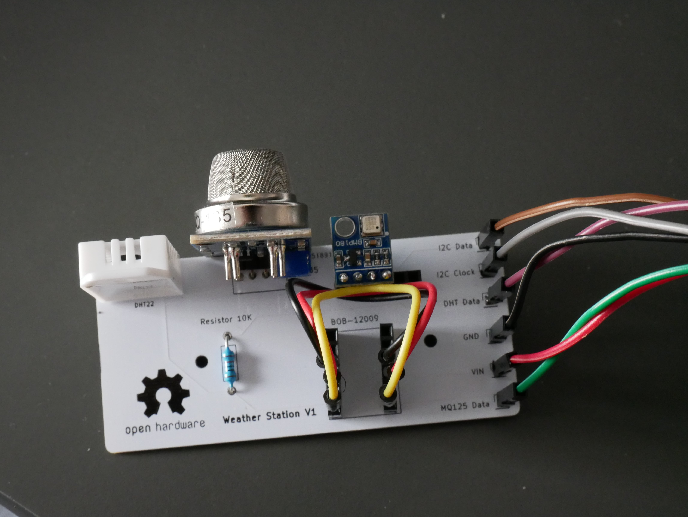
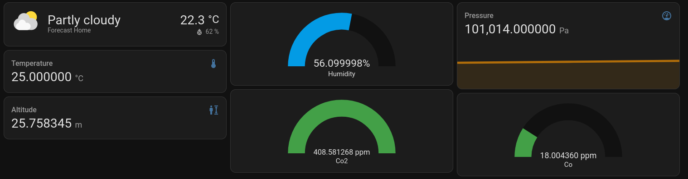
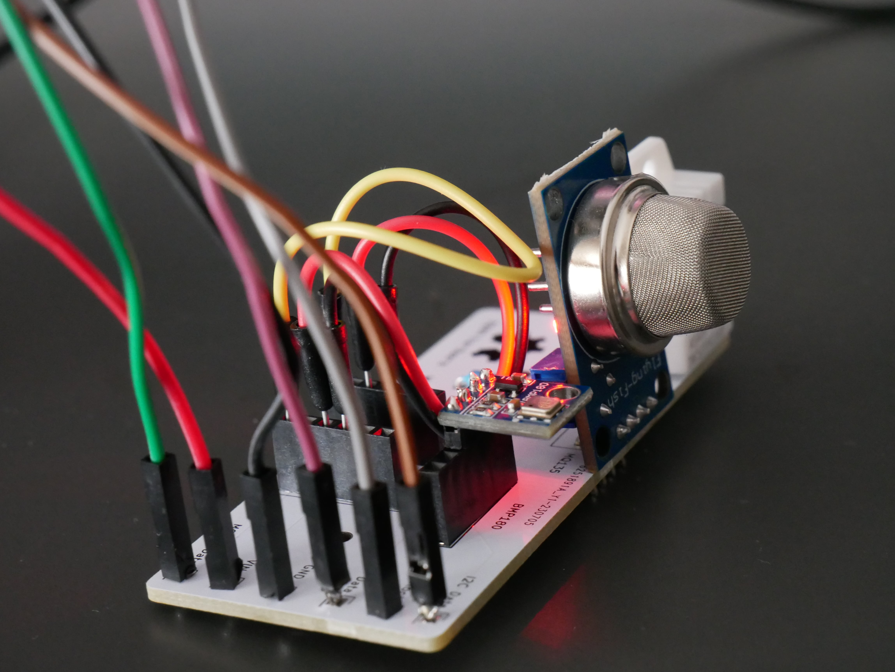
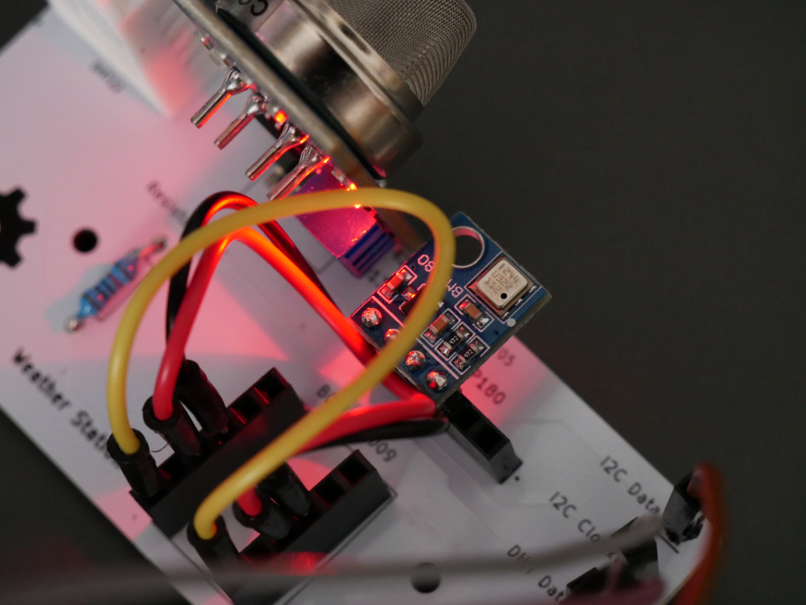
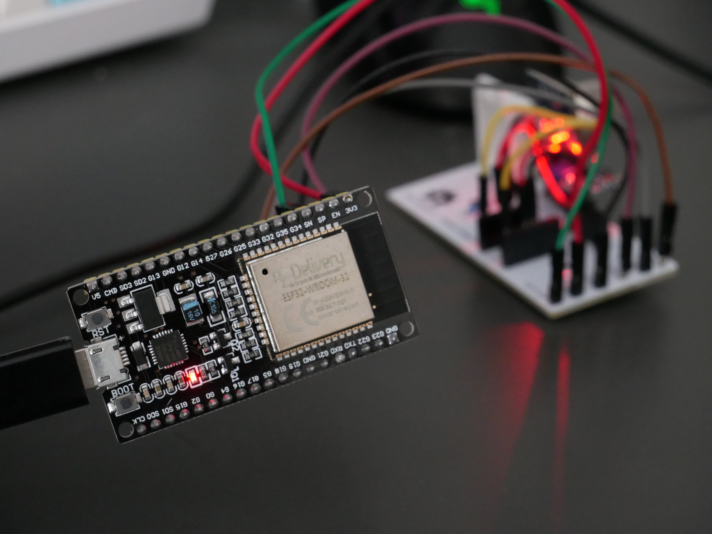
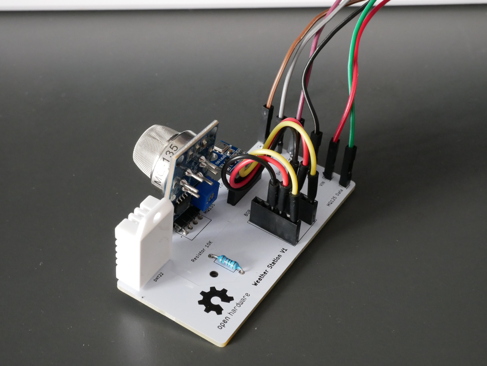
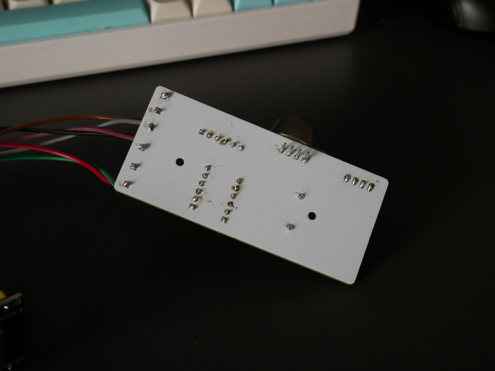
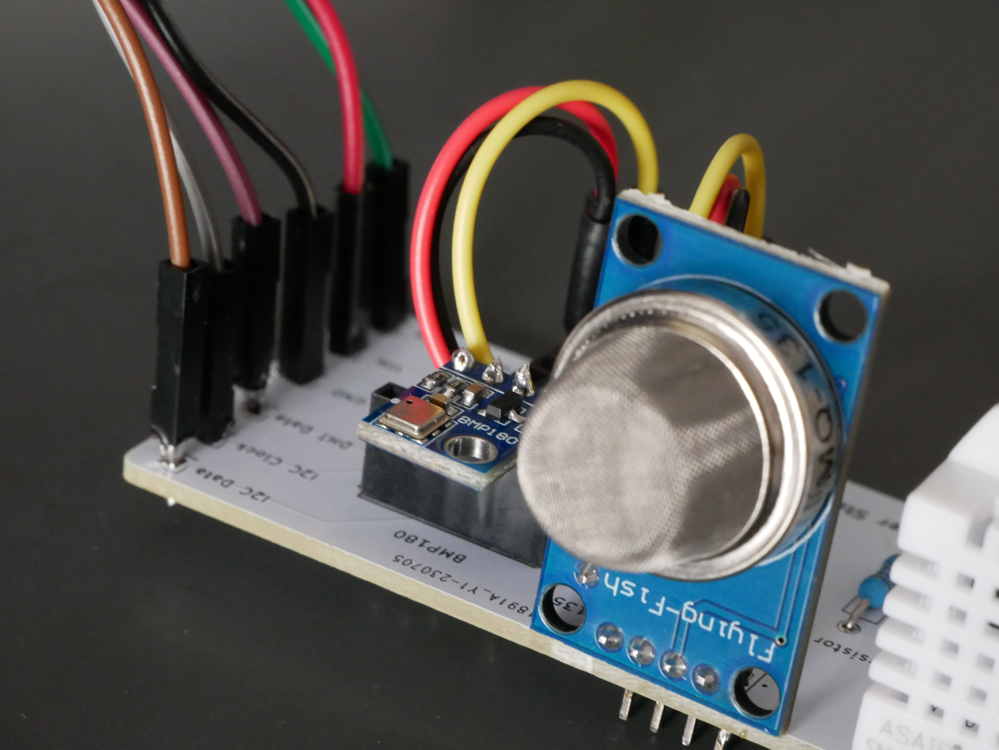

[](https://opensource.org/licenses/MIT)
[](https://GitHub.com/Naereen/StrapDown.js/commit/)
[](https://github.com/Naereen/StrapDown.js)
[](https://github.com/ellerbrock/open-source-badges/)

# Weather Station :cloud: :sunrise_over_mountains: :rainbow:



## Description of the project

DIY weather station with 

The goal is to build from scratch a small intelligent weather station that can be connected to **IOT** networks.

It features the following sensors:
- temperature
- humidity
- pressure
- altitude
- gas (Ammonia, Nitrogen Oxide, Alcohol, Benzene, Co2, CO ...)

This GitHub repository describes the entire project, from the choice of components to the software.

## Get started

### How to setup the code

- Clone this [repository](https://github.com/VincentKobz/diy-weather-station/).

- Add this URL `https://raw.githubusercontent.com/espressif/arduino-esp32/gh-pages/package_esp32_index.json` to the additional boards manager in your IDE.

- Install the right package for your board (for me it's an [ESP32](https://github.com/espressif/arduino-esp32)).

Arduino librairies that need to be installed:
- [PubSubClient](https://pubsubclient.knolleary.net/): for MQTT protocol.
- [MQUnifiedSensor](https://github.com/miguel5612/MQSensorsLib): for MQ135 sensor.
- [Adafruit BMP085](https://github.com/adafruit/Adafruit-BMP085-Library): for BMP180 sensor.
- [DHT sensor](https://github.com/adafruit/DHT-sensor-library): for DHT22 sensor.

Inside `global_data.h`, replace `SSID`, `SSID_PWD`, `MQTT_SERVER_IP`, `MQTT_PORT`, `MQTT_DEVICE_ID` with your values.

This file contains all GPIO and sensor configuration, as well as global variables and macros.

## Bill Of Materials

All the information on **components** (BOM) and electronic schematics: [link](bom.md)

## Electronic card schematic and PCB

All the information on custom **PCB** (Printed Circuit Board): [link](kicad/kicad.md)

## Integration to home-assistant

[Home assistant](https://www.home-assistant.io/) is an open source software for home automation. I successfully connect my DIY weather station to it with an **MQTT** broker.



- First, the **MQTT** integration needs to be configured with broker's address, port and credentials. This can be done with the user interface.

Here is an example of the `configuration.yaml` file.

```yaml
mqtt:
  - sensor:
      # DHT22 temperature
    - name: "temperature"
      device_class: temperature
      state_topic: "esp32/out/temperature"
      unit_of_measurement: "°C"
```

- Inside the `mqtt` section, a list of sensors can be added. Here I defined the name, the [`device_class`](https://www.home-assistant.io/integrations/sensor/), the name of the topic to listen and the unit of the data.

## Photos of the Weather Station V1

The project is not finished.
I will improve it in the future, with an optimized PCB, new sensors and a 3d printed case.







