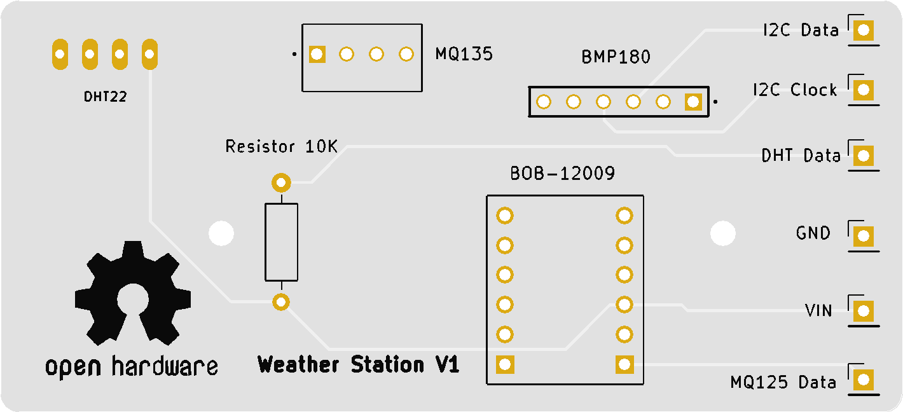

# KICAD LIBRAIRIES

## Kicad project

Schematic and pcb design of my board were created using [Kicad](https://www.kicad.org/) 6.0.2.

## Footprints and symbols

Kicad project requires footprints and symbols librairies.

Here is the list of these librairies, which can be downloaded from [SnapEDA](https://www.snapeda.com/).

- [bmp180](https://www.snapeda.com/parts/HTSW-106-07-S-S-LL/Samtec/view-part/?t=HTSW-106-07-S-S-LL)
- [bob-12009](https://www.snapeda.com/parts/BOB-12009/SparkFun/view-part/?t=bob12009)
- [dht22](https://www.snapeda.com/parts/DHT22/Aosong%20Electronics/view-part/?t=dht22)
- [mq135](https://www.snapeda.com/parts/3-641215-4/TE%20Connectivity/view-part/?t=3-641215-4)

## PCB

\
Weather Station PCB V1
